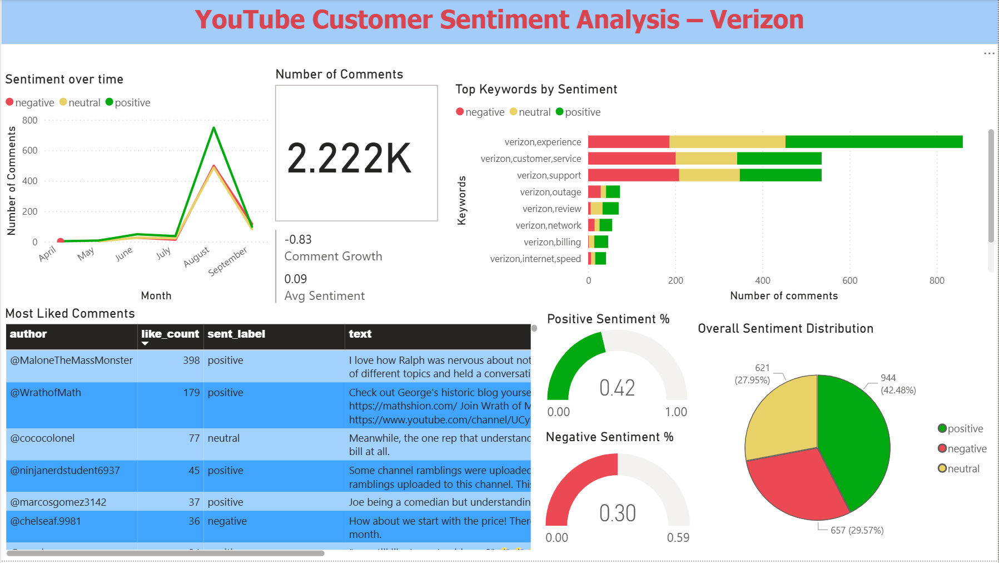

### Social Sentiment Pipeline (YouTube → C++ → Python → Power BI)

This project implements an end-to-end **data engineering and analytics pipeline** that ingests, cleans, and visualizes customer sentiment from **YouTube comments**.  
The workflow demonstrates how to combine **C++ for scalable ingestion**, **Python for data transformation and sentiment scoring**, and **Power BI for business intelligence dashboards**.  

### 🌟 Project Goals
- Automate **data ingestion** from the YouTube Data API using a custom C++ ETL client.  
- Transform and enrich comments with **cleaning, deduplication, and sentiment analysis** using Python (VADER).  
- Deliver actionable insights with a **Power BI dashboard** for stakeholders.  

### 📊 Key Insights (from the dashboard below)
- Collected **2,222 comments** over a **150-day window** related to Verizon.  
- **Sentiment distribution:** ~42% positive, ~30% negative, ~28% neutral.  
- Peaks in negative sentiment aligned with reported **network outages**, while positive sentiment was higher around **customer service and support discussions**.  
- The most liked positive comment gained **398 likes**, showing strong engagement on supportive content.  
- Keywords like *experience*, *customer service*, and *support* dominated conversation themes.  


---

## 📊 Dashboard Preview
The Power BI dashboard below combines sentiment trends, keyword analysis, and comment highlights:  


---

## 🚀 Architecture
YouTube API → C++ CLI (ingest_yt) → NDJSON (data/raw)
→ Python (transform_comments.py) → CSV/Parquet (data/curated)
→ Power BI report (pbix)


---

## 🛠 Tech Stack
- **C++20**: ETL ingestion (CMake, vcpkg, libcurl, nlohmann/json, spdlog)  
- **Python**: Data cleaning & sentiment analysis (pandas, vaderSentiment, pyarrow)  
- **Power BI**: Interactive dashboard (KPIs, gauges, trends, word cloud)  

---

## 📂 Folder Structure
```
├── cpp_ingest/ # C++ ETL client
│ ├── include/
│ ├── src/
│ └── build/ # compiled binaries (ignored in git)
│
├── py_transform/ # Python transformer
│ ├── requirements.txt
│ └── transform_comments.py
│
├── data/
│ ├── raw/ # NDJSON outputs from ingestion (ignored in git)
│ └── curated/ # CSV/Parquet cleaned outputs (ignored in git)
│
├── run_verizon.sh # Batch ingestion script for multiple keyword sets
└── README.md
```


---

## 🔧 Setup Instructions

### 1. Build C++ Ingestion
From Git Bash with MSVC + vcpkg installed:
```bash
cd cpp_ingest
mkdir build && cd build
cmake .. -G "Visual Studio 17 2022" -A x64 -DCMAKE_TOOLCHAIN_FILE="$VCPKG_ROOT/scripts/buildsystems/vcpkg.cmake" -DVCPKG_TARGET_TRIPLET=x64-windows -DCMAKE_BUILD_TYPE=Release
cmake --build . --config Release

```
This produces:
```bash

cpp_ingest/build/Release/ingest_yt.exe
```
### 2. Run Ingestion
Set your YouTube Data API key:

```bash

export YOUTUBE_API_KEY="YOUR_API_KEY"

```
Example run:
```bash

./ingest_yt.exe --brand "verizon" --keywords "verizon,5g" --days 30 --limit_videos 30 --out ../../data/raw/verizon_5g.ndjson
```
Batch run across multiple keywords:

```bash

cd cpp_ingest/build
bash run_verizon.sh
```
### 3. Transform + Sentiment (Python)
Install dependencies:

```bash
cd py_transform
pip install -r requirements.txt
```
Run the transformer:

```bash

python transform_comments.py --in ../data/raw --out ../data/curated --brand verizon
```
Outputs:

comments_clean.csv → full dataset with sentiment labels

comments_clean.parquet → fast format (optional)

sentiment_counts.csv → aggregated positive/negative/neutral counts


